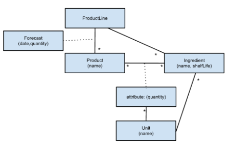
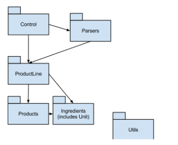

## Introduction

This Java language example is intended to support the following article:

https://www.infoq.com/articles/arm-enterprise-applications/ - An Architectural Reference Model for larger applications.

### Summary - Packages and their Layers.

To understand this application it is necessary to read the requirement below, but in summary the packages are distributed as follows across the strata (informally layers) of the ARM (as referenced in the aforementioned article):

* *Control* - is part of the Interface Layer - it deals with *user-input* (command-line arguments) and as such performs a similar role to a GUI input. In particular it uses the same Application Layer 'API' as  GUI most likely would.
* *Parsers* - Interface Layer - contains code to translate from input file (via reasonably sophisticated parsing)  and to make appropriate calls into the Application layer (via the 'service API - which could be wrapped in a REST api - but isn't here).
* *ProductLine* - Application layer. It exposes an "API" for Interface Layer to use and calls down into the Domain Layer.
* *Products* & *Ingredients* - Domain Layer - again called by the *ProductLine* package in Application Layer.
* *Utils* - Infrastructure Layer - generic utilities not bound to this application particularly.

## Requirement

A food manufacturing company has a requirement to rapidly <u>calculate the number of days of forecast demand</u> for its finished products that <u>their current stock levels of raw materials can support</u>. An application is required to support this.

The <u>products</u> that the company produces are currently:  Chocolate Cake; Iced Buns; Victoria Sponge; Malt Loaf, however the application should be user configurable (via file inputs) to enable the <u>generic addition of these and other products and their related ingredients</u>. Generic means including products as yet undefined.

### Specific Features Required

The application is required to support the following:

* The <u>addition of new products</u>, and any new <u>raw materials required for the new products</u>. A <u>product ingredient list file</u> should be used for this.

* The <u>removal of a product from calculations</u> (to enable the company to see what impact, for example, stopping production of chocolate cakes would have on the stock days. A likely solution to this is to <u>remove or comment items out</u> from an input file - to see the difference that makes.

* The ability to <u>easily change the ‘mix’ of raw materials</u> for each product, to see what impact that would have on stock days.

* Any <u>input files</u> used should <u>support a comment character (#)</u>  at the beginning of any line - comments should be then ignored.

* <u>Unit types</u> should be defined in a <u>generic and easily extendible manner</u>. The application shoudl be set up to read by kg (kilogram) and g (gram), and also litres and ml (millilitres). The application should deal  with <u>conversion of units</u> as appropriate.

* The <u>names of all input files</u> should be provided <u>on the *command line*</u> in the following order when running the program: ingredients stock level file; product ingredients list file; product sales forecast file, e.g. 

  ```
  <program-name> stock-levels.eg product-ingredients.eg product-forecast.eg
  ```

  See "Appendix" below for details on the exact formats of these files.  The '.eg' extension is optional.

## Discussion of Solution

### Domain Model (DDD)

Here is the domain model for the requirement as stated:



NB: assume a multiplicity of <u>one</u> if no value shown, “*” indicates <u>0 to many</u>, as per UML. 

Major relationships:

* A <u>ProductLine</u> has many Products (chocolate cake, malt loaf ...), Ingredients (sugar, vanilla essence ...) and <u>Unit</u>s (kgs, liters ...) associated with it.
* Each <u>Product</u> on the <u>ProductLine</u> may have an associated <u>Forecast</u> which says how many items are predicted to be sold on a particular date.
* A <u>Product</u> has many <u>Ingredient</u>s, each individual Ingredient has a <u>quantity</u> associated with it (e.g. malt loaf has 3g of sugar in it).
* Each <u>Ingredient</u> has a <u>Unit</u> associated with it (e.g. vanilla essence is measured in litres).

Other notes:

* Most entities (classes) have a name, the exceptions being quantity which is really just a number and an attribute of the <u>Product</u>/<u>Ingredient</u> association, and <u>ProductLine</u> - which is really there to bind everything together.

### Package model

The implementation has the following package structure and dependencies (NB: Not all dependencies are shown. Dependencies are transitive (so Parsers know about Products, etc...);  Utils is misc useful stuff. It is depended on by a lot; Dependencies are <u>unidirectional</u> and <u>acyclic</u> - as shown by arrowheads.



### Design

Apart from the package structure the major design points are:
* <u>ProductLine</u> provides a “<u>service oriented architecture</u>” access point to the domain elements. Control and Parsers use this. In the event of a <u>graphical</u> UI being required, ProductLine would still provide the major point of access into the core of the system. Many of the required methods are already there - as is often the case in applications that have multiple Interfaces (REST API and GUI, for example)
* <u>ProductLine</u> keeps tabs on <u>Products</u> and <u>Ingredient</u>s - using HashMaps. These are referenced by the <u>Product</u> or <u>Ingredient</u> name (a String).
* <u>Products</u> keep a list of Ingredients that they use. Again, HashMaps and String names.
* Units are part of the Ingredients package. Ingredients keep tabs on their units (e.g. sugar is in grams - and this is stored within the Ingredient. Unit is an enum and also provides some unit conversion aids (e.g. converting litres to ml). This be extended to cope with “tbsp”, etc. with relative ease (but isn't). (Contributions welcome!)
* <u>Parsers</u> raise <u>ParseError</u> exceptions when something is wrong. <u>Control</u> deals with the presentation of this information to the user. None of the lower level packages (<u>Product</u>, <u>Ingredient</u> …) know anything about this (of course - as per the ARM separation of concerns - aka keep interface and business logic separate).
* To faciliate unit tests, the <u>Parser</u>s take arrays of Strings (instead of files). This also has the nice effect that comment lines (beginning with ‘#’) can be stripped out before the Parser gets to see them, making the syntax checking far easier.

### Source Code Structure / Test Scripts
* The top level directory (a.k.a in this description: $ROOT) contains all the packages, and three (Unix Shell) scripts:
  * runMainSimpleTestData.sh - runs the main application using some easy to figure out test data.
  * runMainSuppliedData.sh - runs the main application using additional test data.
  * runTests.sh - runs all the unit tests (all packages contain these, except the Control package).

  Take a look inside these shell scripts to vary the files used or the tests, etc. They are very simple (but are Linux based).

* The rest of the src tree is structured as follows:

  ```
  $ROOT
  |-
    |-products (Domain Layer - see above)
    |-productLines (Applciation Layer - see above)
    |-parsers (Interface Layer - see above)
    |-EXTERNAL-LIBS (for ease of use, copies of Jars used by App.)
    |-ingredients (Domain Layer - see above)
    |-control(Interface Layer - see above)
    |-testData
    |  |-testSetGiven
    |  |-testSetSimple
    |-utils (Infrastructure Layer - see above)
  ```

  Other information

- test data (input files) is held under the testData directory in $ROOT. No surprises there.
- there are two sets of test data (file) as per the discussion of scripts (.sh files) above.
- To generate syntax errors (or semantic errors)  just edit the test data files (all of which have a “.eg” extension and you'll see the errors being reported when you run the application or related test code.

### Improvements

#### Runtime vs Checked Exceptions

The single major thing I would improve here would be to make <u>DuplicateKeyException</u> and <u>UnknownKeyExcepion</u> (as raised by <u>CheckedMap</u> in <u>utils</u>) extend RuntimeException rather than Exception. There's much debate out there about this topic. I have come to favour the RuntimeException approach, exception *except* in specific circumstances (email me if you'd like to discuss! :-).

#### Unit as Infrastructure

A pretty good case could be made for <u>Unit</u> to be part of <u>Utils</u> (and therefore Infrastructure in terms of the ARM). Alternatively, it could remain in the Domain layer but be pulled out into its own package - unit (which would make any possible re-use simpler) in much the same way Product and Ingredient are their own package. Time allowing, I'll refactor this (or volunteers welcome!)

#### Other possible improvements

There are always things that could be done better! However, diminishing returns, etc. Contributors (:-) might like to consider:

* <u>ParseError</u> could  be subclassed to make the different types of error more explicit. At present an error String is used to indicate exactly what the error is. This is a weakness when it comes to the JUnit tests (tests for exceptions being thrown).
* To test exceptions I have used “fail” under the line of code where exceptions should be thrown. There are other ways...
* The <u>Parser</u> unit tests need a little refactoring to tidy them up and remove some duplication.
* <u>testParser.java</u> could be broken into three test classes, one for each file type. At present it does all the tests for all Parsers.
* It could be made compulsory for any dates in input files to be in ascending order.
* The file formats themselves could be rationalised a little.
* Adding “tsp” and “tbsp” to be units (and converting them to grams or millilitres).

## Appendix - Detailed File Input Formats:

### Ingredients (List of) Input File
Ingredient lists are supplied in a file format as per the below:

```
Chocolate Cake
175,g,butter
175,g,self-raising flour
15,g,cocoa powder
175,g,butter
175,g,sugar
5,g,baking powder
3,qty,eggs

Iced Buns
110,g,butter
110,g,sugar
2,qty,eggs
1,ml,vanilla extract
140,g,plain flour
1,g,baking powder
100,g,icing sugar

Victoria Sponge
225,g,butter
225,g,sugar
4,qty,eggs
2,ml,vanilla extract
225,g,self-raising flour

Malt Loaf
450,g,plain flour
15,g,yeast
225,g,sultanas
5,g,sugar
60,ml,malt extract
30,ml,black treacle
25,g,butter
```
Where:
* first line in name of product,
* lines below list list in comma delimted form: amount, unit, stock-item
* a blank line indicates a new product starts on the next line.

### Stock Level Input File
Stock levels are supplied in a file in the format below:
```
self-raising flour,kg,500
plain flour,kg,200
cocoa powder,kg,10
butter,kg,800
sugar,kg,600
baking powder,kg,15
yeast,kg,10
eggs,qty,10000
vanilla extract,litres,10
icing sugar,kg,100
sultanas,kg,100
malt extract,litres,20
black treacle,litres,5
```

### Product Forecast Input File (Forecast Required)

For the demand forecast, the first line will contain dates: ‘,[date1],[date2],….,[datey]’, the following lines will contain expected demand for each finished product for each day: ‘[finished product name],[date1 demand],[date2 demand],….,[datey demand]’, e.g.:

Here is a full example of the Product Forecast File contents:

```
,1/2/12,2/2/12,3/2/12,4/2/12,5/2/12,6/2/12,7/2/12,8/2/12,9/2/12,10/2/12
Chocolate Cake,100,50,200,20,700,60,50,30,100,900
Iced Buns,50,10,100,10,300,200,200,10,200,200
Victoria Sponge,100,100,500,500,90,80,50,80,10,200
Malt Loaf,50,50,50,50,50,50,50,50,50,50
```

### Other Misc Notes

* CLASSPATH is set in: classpath.shi - which is 'included' (using '.') in other bash scripts (.sh).
* CLASSPATH uses the EXTERNAL-LIBS directory as specified above. If you want to move EXTERNAL-LIBS - change the CLASSPATH in classpath.shi (only need to change once).
* set CLASSPATH globally if you wish to run tests, etc. manually (not using bash scripts).
* See $ROOT/src/EXTERNAL-LIBS for external dependencies.

## Credits

* Diagrams created using Enterprise Architect - an excellent CASE tool. With thanks to Sparx Systems - see https://sparxsystems.com/
* README created using Typora - a very useful markdown editor that does its job without over-complicating matters - see https://typora.io/. 
